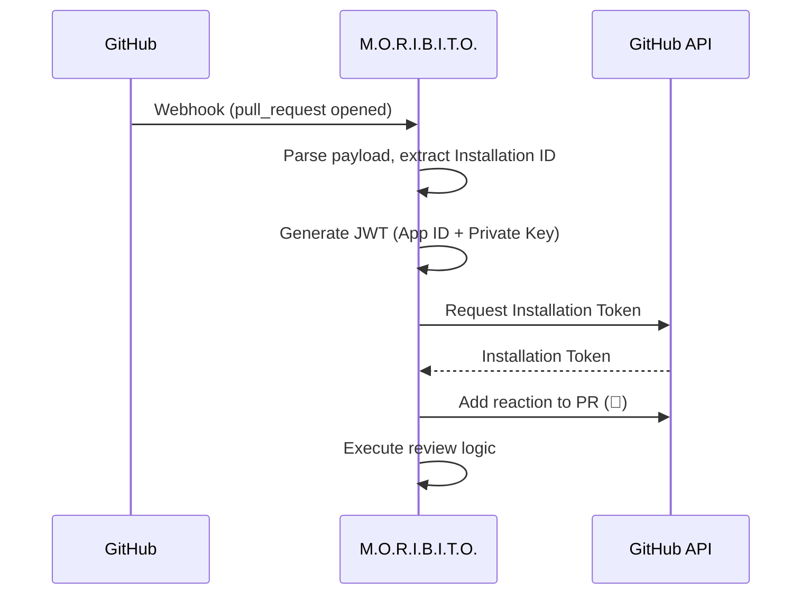

<p align="center">
  
</p>

<h1 align="center">M.O.R.I.B.I.T.O.</h1>
<p align="center">
  <strong>Monitoring Orchestrator for Repository Issues and Build Integrity; Trustee Officer.</strong><br>
  A GitHub App appointed to oversee issues, reviews, and entrusted operations within your repository.
</p>

---

## About

**M.O.R.I.B.I.T.O.** is a GitHub App that acts as a repository's appointed "Trustee Officer."  
It monitors activity, supports discussions, assists reviews, and can execute entrusted tasks on your behalf.

Built with Go using `net/http` for webhook handling and `go-github` for GitHub API interactions.

## Features

- **Webhook Processing**: Receives and validates GitHub webhook events
- **PR Review Automation**: Automatically acknowledges new PRs with 👀 reaction
- **Async Job Queue**: Background processing for long-running tasks
- **Extensible Architecture**: Easy to add new event handlers and review logic

## Quick Start

### Prerequisites

- Go 1.21+
- GitHub App credentials (App ID, Private Key)

### Installation

```bash
git clone <repository-url>
cd moribito
go mod tidy
make build
```

### Configuration

Set the required environment variables:

```bash
export GITHUB_APP_ID=123
export GITHUB_PRIVATE_KEY_PATH=/path/to/private-key.pem
```

### Run

```bash
./bin/host/moribito
```

The server starts on `:8080` with endpoints:
- `GET /healthz` - Health check
- `POST /webhook` - GitHub webhook receiver

## Environment Variables

| Variable | Required | Description |
|----------|----------|-------------|
| `APP_ADDR` | No | Listen address (default: `:8080`) |
| `GITHUB_APP_ID` | **Yes** | GitHub App ID for JWT creation |
| `GITHUB_PRIVATE_KEY_PATH` | **Yes** | Path to App private key (PEM) |
| `GITHUB_INSTALLATION_ID` | No | Installation ID (for CLI token command) |
| `GITHUB_WEBHOOK_SECRET` | No | Webhook signature secret |
| `GITHUB_WEBHOOK_PATH` | No | Webhook endpoint path (default: `/webhook`) |
| `GITHUB_API_BASE_URL` | No | API URL (default: `https://api.github.com`) |

## PR Review Flow

When a Pull Request is opened, the app follows this flow:

```
PR Created → Webhook Received → Acknowledge (👀) → Process Review
```

1. **Acknowledge**: Adds 👀 (eyes) reaction to show the request was received
2. **Process**: Executes review logic (extensible for AI review, linting, etc.)

## Architecture

```
cmd/moribito/          # CLI entry point
internal/
├── config/            # Environment configuration
├── githubapp/         # GitHub API client & authentication
├── queue/             # Background job queue
├── review/            # PR review service
├── server/            # HTTP server
└── webhook/           # Event routing & handlers
test/fixtures/         # Test data
```

See [docs/ARCHITECTURE.md](docs/ARCHITECTURE.md) for details.

## Development

### Build & Test

```bash
make build    # Build binary
make test     # Run tests
make lint     # Run linter
```

### Local Webhook Testing with smee

1. Create a smee channel at [smee.io](https://smee.io)
2. Set the smee URL as your GitHub App's Webhook URL
3. Run the smee client:

```bash
npx smee-client -u https://smee.io/<your-id> -p 8080 -P /webhook
```

4. Start the app:

```bash
export GITHUB_APP_ID=<your-app-id>
export GITHUB_PRIVATE_KEY_PATH=<path-to-key.pem>
./bin/host/moribito
```

### Verify Installation Token

```bash
export GITHUB_APP_ID=123
export GITHUB_INSTALLATION_ID=456
export GITHUB_PRIVATE_KEY_PATH=/path/to/private-key.pem

./bin/host/moribito --print-installation-token
```

## Authentication Flow



## Documentation

- [docs/ARCHITECTURE.md](docs/ARCHITECTURE.md) - System architecture
- [docs/CONFIG.md](docs/CONFIG.md) - Configuration details
- [docs/DEVELOPMENT.md](docs/DEVELOPMENT.md) - Development guide
- [docs/OPERATIONS.md](docs/OPERATIONS.md) - Operations guide

## License

See [LICENSE](LICENSE) file.
