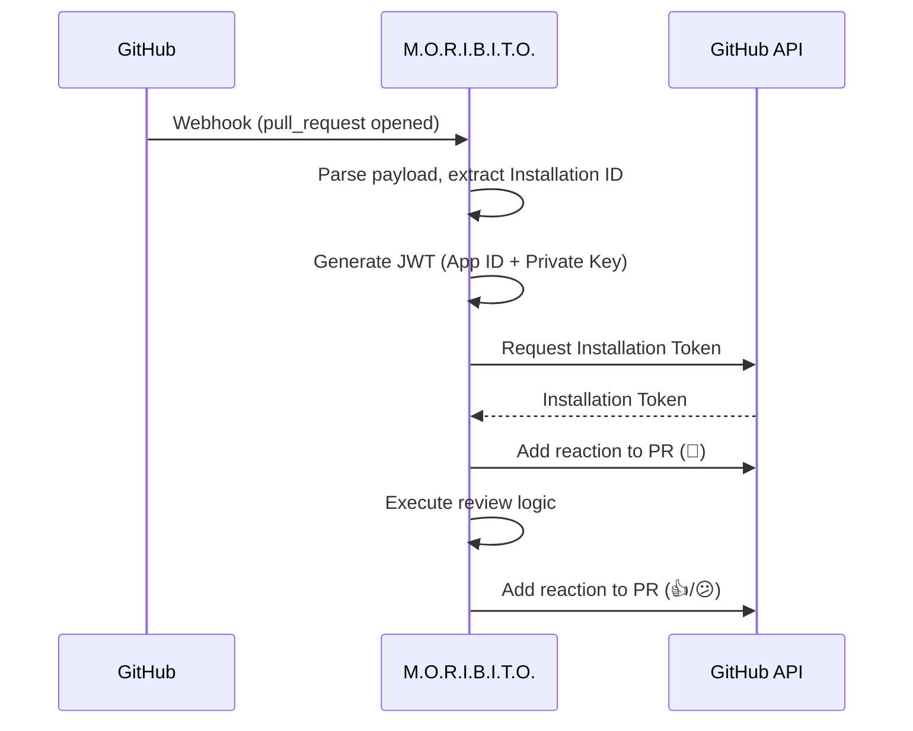

<p align="center">
  
</p>

<h1 align="center">M.O.R.I.B.I.T.O.</h1>
<p align="center">
  <strong>Monitoring Orchestrator for Repository Issues and Build Integrity; Trustee Officer.</strong><br>
  A GitHub App appointed to oversee issues, reviews, and entrusted operations within your repository.
</p>

---

## About

**M.O.R.I.B.I.T.O.** is a GitHub App that acts as a repository's appointed "Trustee Officer."  
It monitors activity, supports discussions, assists reviews, and can execute entrusted tasks on your behalf.

Built with Go using `net/http` for webhook handling and `go-github` for GitHub API interactions.

## Features

- **Webhook Processing**: Receives and validates GitHub webhook events
- **PR Review Automation**: Automatically acknowledges new PRs with 👀 reaction
- **AI-Powered Code Review**: Integrates with [OpenCode](https://opencode.ai) server for intelligent code reviews
- **Issue AI Response**: Responds to issue comments starting with `@moribito`
- **Customizable Prompts**: Multiple built-in templates for PR reviews and issue responses
- **Async Job Queue**: Background processing for long-running tasks
- **Extensible Architecture**: Easy to add new event handlers and review logic
- **Graceful Degradation**: Works without AI when OpenCode is unavailable

## Quick Start

### Prerequisites

- Go 1.21+
- GitHub App credentials (App ID, Private Key)

### Installation

```bash
git clone <repository-url>
cd moribito
go mod tidy
make build
```

### Configuration

Create a JSON config file and set its path:

```bash
export MORIBITO_CONFIG_PATH=/path/to/moribito.json
```

### Run

```bash
./bin/host/moribito
```

The server starts on `:8080` with endpoints:
- `GET /healthz` - Health check (JSON)
- `POST /webhook` - GitHub webhook receiver

## Configuration

Set the config file path via environment variable:

| Variable | Required | Description |
|----------|----------|-------------|
| `MORIBITO_CONFIG_PATH` | **Yes** | Path to JSON config file |

See `docs/CONFIG.md` for the JSON format and examples.

## PR Open Flow

When a Pull Request is opened, the app follows this flow:

```
PR Created → Webhook Received → Acknowledge (👀) → AI Review → Post Comment → Acknowledge (👍/😕)
```

1. **Acknowledge**: Adds 👀 (eyes) reaction to show the request was received
2. **Fetch Diff**: Retrieves PR diff from GitHub API
3. **AI Review**: Sends diff to OpenCode server for analysis (if available)
4. **Post Comment**: Posts AI review as a PR comment
5. **Complete**: Adds 👍 on success, 😕 if AI failed

### Prompt Templates

Prompt templates are loaded from files. Sample templates are available under `docs/templates/`.

| File | Description |
|------|-------------|
| `docs/templates/pr-response-open.md.tmpl` | Initial PR review |
| `docs/templates/pr-response-open-concise.md.tmpl` | Brief review focusing on critical issues |
| `docs/templates/pr-response-open-ja.md.tmpl` | Review output in Japanese |
| `docs/templates/pr-response-open-security.md.tmpl` | Security-focused analysis |
| `docs/templates/pr-response-comment.md.tmpl` | Re-review response for PR comments |
| `docs/templates/issue-response.md.tmpl` | Standard issue comment response |
| `docs/templates/issue-response-ja.md.tmpl` | Issue response in Japanese |
| `docs/templates/issue-technical.md.tmpl` | Technical troubleshooting focus |

## Issue AI Response

The app responds to issue comments that start with `@moribito` (customizable via `ISSUE_TRIGGER_PREFIX`):

```
User Comment → @moribito detected? → Acknowledge (👀) → AI Response → Post Comment → Acknowledge (👍/😕)
```

### How to Use

In any issue, add a comment starting with `@moribito` (or your configured prefix):

```
@moribito How do I fix this error?
```

The bot will:
1. Add 👀 reaction to acknowledge
2. Analyze the issue context with AI
3. Post a helpful response
4. Add 👍 on success (😕 if AI failed)

## Architecture

```
cmd/moribito/          # CLI entry point
internal/
├── config/            # Environment configuration
├── githubapp/         # GitHub API client & authentication
├── opencode/          # OpenCode server API client
├── prompt/            # Prompt templates & builder
├── queue/             # Background job queue
├── review/            # PR review service
├── server/            # HTTP server
└── webhook/           # Event routing & handlers
test/fixtures/         # Test data
```

See [docs/ARCHITECTURE.md](docs/ARCHITECTURE.md) for details.

## Development

### Build & Test

```bash
make build    # Build binary
make test     # Run tests
make lint     # Run linter
```

### Local Webhook Testing with smee

1. Create a smee channel at [smee.io](https://smee.io)
2. Set the smee URL as your GitHub App's Webhook URL
3. Run the smee client:

```bash
npx smee-client -u https://smee.io/<your-id> -p 8080 -P /webhook
```

4. Start the app:

```bash
export MORIBITO_CONFIG_PATH=/path/to/moribito.json
./bin/host/moribito
```

### Verify Installation Token

```bash
export MORIBITO_CONFIG_PATH=/path/to/moribito.json
./bin/host/moribito --print-installation-token
```

### Show Version

```bash
./bin/host/moribito -v
```

## Authentication Flow



## Documentation

- [docs/ARCHITECTURE.md](docs/ARCHITECTURE.md) - System architecture
- [docs/CONFIG.md](docs/CONFIG.md) - Configuration details
- [docs/DEVELOPMENT.md](docs/DEVELOPMENT.md) - Development guide
- [docs/OPERATIONS.md](docs/OPERATIONS.md) - Operations guide

## License

See [LICENSE](LICENSE) file.
