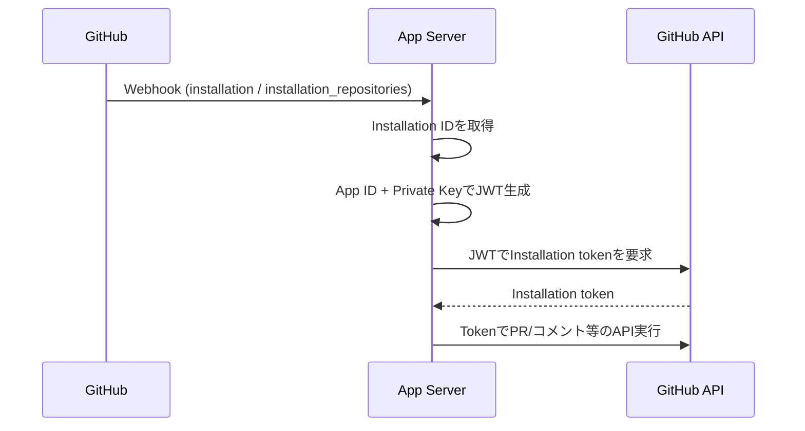

# pghapp

GolangでGitHub Appを作るための雛形です。標準の`net/http`だけでWebhook受信と認証の骨組みを提供します。

## Prerequisites

- Go 1.21+

## Setup

```bash
go mod tidy
```

## Build

```bash
make build
```

## Run

```bash
go run ./cmd/app
```

起動後は`/healthz`と`/webhook`が利用できます。

## Test

```bash
make test
```

## GitHub Appの基本

- App ID: GitHub Appを識別するIDです。
- Private Key: JWT署名に使う秘密鍵です（App側で発行）。
- Installation ID: インストールされた組織/リポジトリを識別します。
- Webhook Secret: Webhookの署名検証に使います。
- API Base URL: GitHub Enterprise Server向けに`https://<host>/api/v3`へ変更できます。

## 雛形の狙い（何が入っているか）

- Webhook受信: `/webhook`でイベントを受け取り、署名検証を行います。
- 認証: App ID + Private KeyでJWTを作成し、Installation tokenを取得できます。
- ルーティング: Webhookイベントごとにハンドラを分離できる構成です。
- 拡張ポイント: Issue/PRイベントへの対応やAPI呼び出しを追加しやすくしています。

## 環境変数

```
APP_ADDR=:8080
GITHUB_WEBHOOK_PATH=/webhook
GITHUB_APP_ID=123
GITHUB_INSTALLATION_ID=456
GITHUB_PRIVATE_KEY_PATH=/path/to/private-key.pem
GITHUB_WEBHOOK_SECRET=secret
GITHUB_API_BASE_URL=https://api.github.com
```

### 使い分けの目安

- `GITHUB_APP_ID` / `GITHUB_PRIVATE_KEY_PATH`: **JWT作成**に必須。
- `GITHUB_INSTALLATION_ID`: **Installation token取得**に必須。
- `GITHUB_WEBHOOK_SECRET`: **Webhook署名検証**に使用（未設定なら検証をスキップ）。
- `GITHUB_API_BASE_URL`: **Enterprise Server**のときは必須。

## ローカル開発の流れ（例）

1. GitHub Appを作成し、Webhook URLを`http://localhost:8080/webhook`に設定します。
2. `GITHUB_PRIVATE_KEY_PATH`に秘密鍵を保存します。
3. `go run ./cmd/app`で起動します。

注: 本リポジトリのWebhook処理は骨組みのみです。イベント内容の処理やAPI呼び出しは今後追加します。

## smeeでWebhookをローカルに中継

1. GitHub AppのWebhook URLに`smee.io`のURLを設定します。
2. smeeクライアントを起動します。

```bash
npx -p smee-client@1.0.2 smee -u https://smee.io/<your-id> -p 8080 -P /webhook
```

3. アプリを起動します。

```bash
go run ./cmd/app
```

注: Node 18環境で動かない場合があるため、`smee-client@1.0.2`を指定しています。

## Installation tokenの取得（動作確認）

以下の環境変数を設定し、トークンを表示します。

```
export GITHUB_APP_ID=123
export GITHUB_INSTALLATION_ID=456
export GITHUB_PRIVATE_KEY_PATH=/path/to/private-key.pem
export GITHUB_API_BASE_URL=https://api.github.com
```

```bash
go run ./cmd/app --print-installation-token
```

注: これはローカル検証向けの機能です。運用時はログや出力先の扱いに注意してください。

## 認証フロー図（概要）



## テスト方針

- `internal/config`: 環境変数の読み取りとバリデーション
- `internal/githubapp`: JWT生成、Webhook署名、Installation token取得、キャッシュ
- `internal/webhook`: イベントルーティングと基本のパース

ローカル検証が必要な場合は、`smee`でWebhookを中継し実イベントで挙動確認できます。
